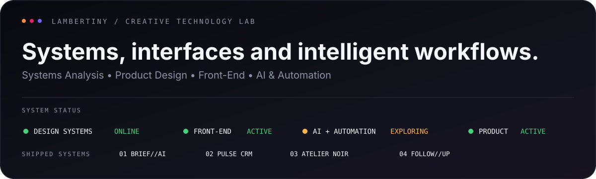

<p align="center">
  
</p>

<p align="center">
  
</p>

<p align="center">
  <a href="https://github.com/Lambertiny?tab=repositories">
    
  </a>
  <a href="https://www.instagram.com/julambertiny">
    
  </a>
  <a href="mailto:julambertiny@gmail.com">
    
  </a>
</p>

---

## About

I'm **Juliana Nascimento — Lambertiny**, a Systems Analyst and Web Designer focused on creating digital products that combine **strategy, interface design, front-end development and intelligent workflows**.

I work across **Web Design, UI/UX, responsive interfaces, CRM systems, automation and digital product experiences**, translating complex processes into clear, useful and visually consistent solutions.

> **Design should not decorate complexity. It should organize it.**

---

## Selected Systems

<table>
<tr>

<td width="33%" valign="top">

### BRIEF//AI

**Creative Intelligence**

Transforms unstructured client input into analysis, strategy, creative direction and a structured PDF output.

**Focus**

`AI Product` `UI/UX` `React` `Vite` `jsPDF`

[Live Demo](https://brief-ai-gamma.vercel.app) · [Repository](https://github.com/Lambertiny/brief-ai)

</td>

<td width="33%" valign="top">

### Pulse CRM

**Client Operations**

A responsive CRM concept for leads, pipeline, tasks, opportunities, automation and business visibility.

**Focus**

`CRM` `Product Design` `React` `Responsive UI`

[Live Demo](https://pulse-crm-ruddy.vercel.app) · [Repository](https://github.com/Lambertiny/pulse-crm)

</td>

<td width="33%" valign="top">

### Atelier Noir

**Editorial Web Experience**

A contemporary architecture portfolio exploring editorial restraint, typography, spatial rhythm and responsive front-end.

**Focus**

`Web Design` `UI/UX` `Front-End` `Responsive`

[Live Demo](https://lambertiny.github.io/atelier-noir/) · [Repository](https://github.com/Lambertiny/atelier-noir)

</td>

</tr>
</table>

---

## Technology Matrix

<p>
  
  
  
  
  
  
  
  
  
  
  
</p>

### Product & Systems

`UI/UX` · `Responsive Design` · `CRM` · `Automation` · `AI-assisted workflows` · `Design Systems` · `Digital Strategy`

---

## GitHub Signal

<p align="center">
  
</p>

<p align="center">
  <sub>
    GitHub statistics reflect repository activity and file composition — not the complete set of technologies I work with.
  </sub>
</p>

---

## Currently Building

```text
LAMBERTINY / BUILD QUEUE

01  BRIEF//AI             SHIPPED
02  PULSE CRM             SHIPPED
03  ATELIER NOIR          SHIPPED
04  PROPOSAL FOLLOW UP    NEXT BUILD
